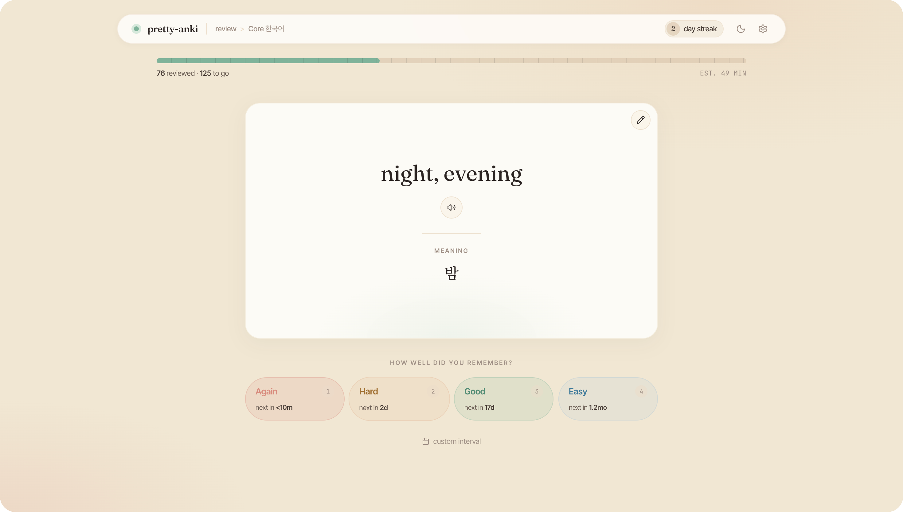

# anki-ui



You love Anki. You do not love looking at it.

This is a calmer face for the same Anki you already use. Your decks, your cards, your scheduling... just wrapped in something nicer to sit in front of for twenty minutes a day. It reads your real collection live through the [AnkiConnect](https://ankiweb.net/shared/info/2055492159) add-on, so anything you do here lands in Anki proper.

> ⚠️ **Reality check:** no amount of prettiness will teach you a language. Concept behind spaced repetition does not change. Consistency will beat the game. This just makes these hours a bit prettier to look at.

What you get:

- **Reviewing** — flip cards and grade them, audio and all, without the clutter
- **AI Teacher** — Ever wanted to have some example sentences for a given anki card? Enter your OpenRouter API key and the pretty-anki ai teacher makes it possible.
- **Deck management** — search, add, edit, and delete cards with a proper rich-text editor
- **Card templates** — tweak how your cards are laid out, with a live preview
- **A dashboard** — your streak, what's due, and a heat-map of the days you've put in

Built for one person's daily Korean reps, so the typography leans Hangul — but it talks to any Anki collection.

## Before you start

- **Keep Anki open.** This is a window into your running Anki, not a replacement — if Anki is closed, there's nothing to show.
- Install the [AnkiConnect](https://ankiweb.net/shared/info/2055492159) add-on in Anki (Tools → Add-ons → Get Add-ons → code `2055492159`, then restart Anki).
- Node 20+ to run it.

> AnkiConnect listens on `localhost:8765` by default. If yours is elsewhere, point the `ANKI_CONNECT_URL` env var at it.

## Getting started

Try it out:

```sh
npx pretty-anki
```

Install it for good:

```sh
npm install -g pretty-anki
pretty-anki
```

`pretty-anki` starts it on <http://localhost:8080> and opens it in your browser. Run it from anywhere, any time you want to study. If the header status dot is muted, Anki/AnkiConnect isn't reachable — check that Anki is open.

## Version & updates

Show latest version of pretty-anki:

```sh
npm view pretty-anki version
```

Find out your installed version:

```sh
npm ls -g pretty-anki
```

Update to the latest version:

```sh
npm install -g pretty-anki@latest
```

## Stack

- `apps/be` — NestJS 11 (ESM) backend that proxies the AnkiConnect HTTP API and validates I/O with Zod
- `apps/ui` — TanStack Start + Vite 7 + React 19 + Tailwind v4, with TipTap for card editing
- `shared` — `@nts/shared`, shared Zod schemas, inferred types, and pure utilities used by both apps
